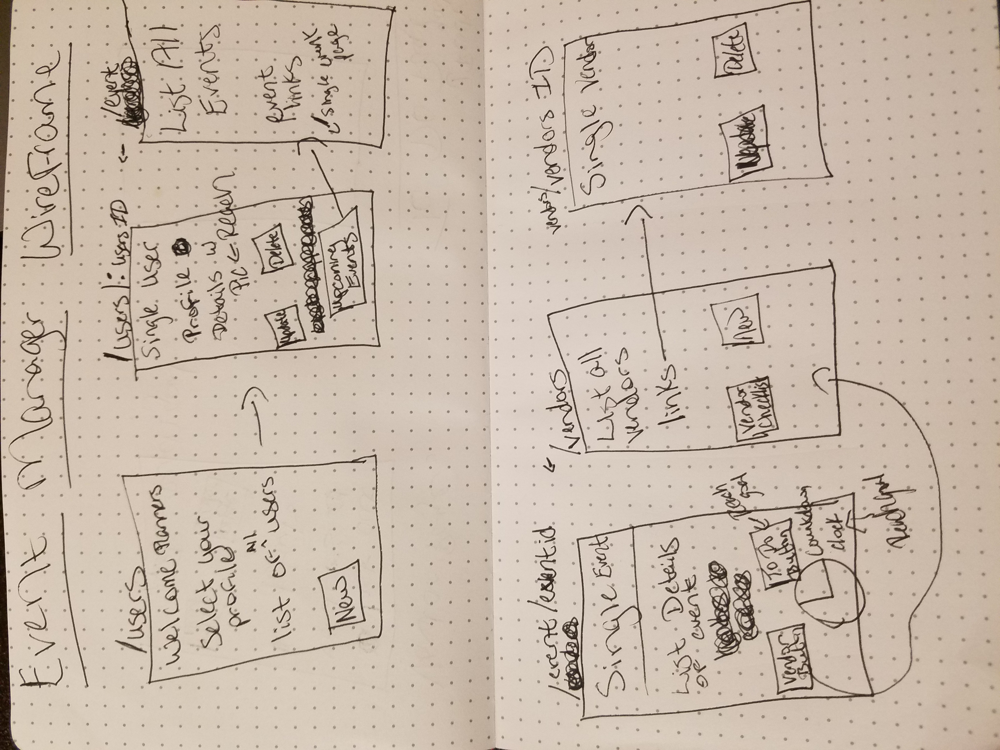
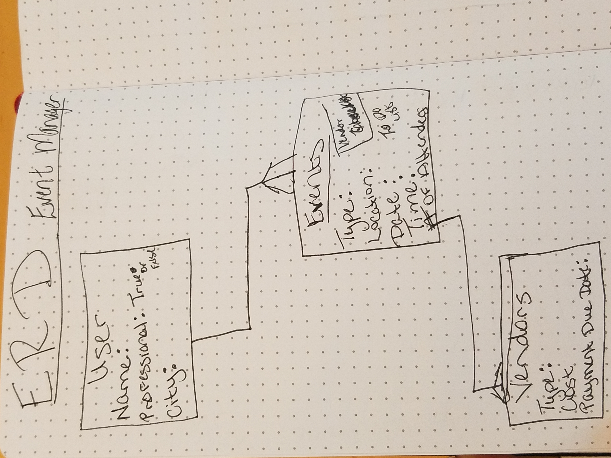

# Unit-2-Project
Event Manager App

<h1> Overview </h1>
Event Manager app is an online application for professional and non professional event planners.  A user can use the application to track many events with many different vendors.

<h1>Project Links</h1>
https://trello.com/b/3vlLRHr9/event-manager-application

https://rocky-springs-54135.herokuapp.com/users

<h1>Technical Specifications</h1>
This application has 3 models. 
Utilizing:
* Javascript
* CSS
* Handlebars
* Express
* Node
* Mongoose DB

<h1>Wireframe</h1>

